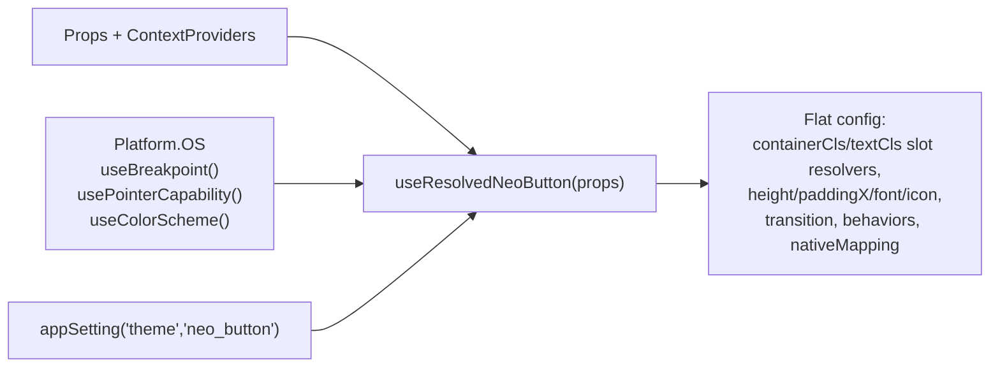

# AI Agent Instructions for NEO Monorepo

> **Purpose:** This document provides structured guidance for LLM coding agents working on the NEO monorepo. Follow these instructions to maintain code quality, consistency, and project integrity.

---

## Table of Contents

- [NEO project summary](#neo-project-summary)
- [Installed agent skills](#installed-agent-skills)
- [Skill precedence (NEO vs generic guidance)](#skill-precedence-neo-vs-generic-guidance)
- [Customization and fork branches](#customization-and-fork-branches)
- [Project Structure Rules](#project-structure-rules)
- [Framework Awareness](#framework-awareness)
- [Server vs Client Components](#server-vs-client-components)
- [Component Architecture](#component-architecture)
- [Styling Guidelines](#styling-guidelines)
- [Animated icons (NEO)](#animated-icons-neo)
- [UNA CMS API Integration](#una-cms-api-integration)
- [Code Quality Checklist](#code-quality-checklist)

---

## NEO project summary

NEO is a **Yarn workspaces monorepo** with **Turborepo** ([`turbo.json`](turbo.json)): shared application code lives in [`packages/app`](packages/app), the web app in [`apps/next`](apps/next) (Next.js 16, App Router), and the native app in [`apps/expo`](apps/expo) (Expo 54, React Native). Styling uses **NativeWind 4** and **Tailwind CSS 3.4** with semantic design tokens from settings—see [readme.md](readme.md) for versions, scripts (`yarn web`, `yarn native`), and setup.

**Product integration** (see also [.cursorrules](.cursorrules)): the frontend targets **UNA CMS** APIs (not a generic REST backend). Use [`app/lib/fetcher`](packages/app/lib/fetcher.js) for requests, follow `/api.php?r=module/action/Template` patterns, respect proxy/env configuration for web vs native, and use **Pusher** where real-time updates are required. Authentication and menus follow existing `currentUser` and [`app/lib/util`](packages/app/lib/util.js) patterns. **Routing**: Expo Router under `apps/expo/app/`, Next.js App Router under `apps/next/app/`.

**Backend contract for UNA developers** ([`una-api` skill](.agents/skills/una-api/SKILL.md)): blocks and services must tolerate **guest (non-logged-in) users**—guard user/profile access, avoid PHP fatals, and return **JSON** for NEO. A fatal or HTML error page on a block breaks page JSON parsing and can blank the whole screen.

**How installed skills help**: Vercel-oriented skills add React/Next performance guidance, cache/PPR notes, Turborepo usage, UI/accessibility audits, deploy automation, browser automation, and Expo/native UI patterns. They **do not** replace NEO-specific rules above when the two conflict—see [Skill precedence](#skill-precedence-neo-vs-generic-guidance).

---

## Installed agent skills

Skills are installed with the [Vercel Agent Skills](https://vercel.com/docs/agent-resources/skills) workflow (`npx skills add <owner/repo>`, optionally `--skill <id>`). **Canonical copy:** [`.agents/skills/`](.agents/skills/) at the repo root (one directory per skill, typically with `SKILL.md`). The CLI also writes **`skills-lock.json`** at the repo root (version pins/hashes for reproducibility) and may create **`.claude/skills/`** symlinks into `.agents/skills/`. **Trae** and **Windsurf** are not used—`.trae/` and `.windsurf/` are gitignored if recreated. This repo also ships a **local** [`una-api`](.agents/skills/una-api/SKILL.md) skill (not from `npx skills`). Commit **`.agents/`**, **`skills-lock.json`**, and **`.claude/skills/`** so the team shares the same capabilities; they are not ignored by default.

**CLI note:** the `skills` package uses **different `--skill` ids** than some GitHub folder names—for `vercel-labs/agent-skills`, use ids such as `vercel-react-best-practices`, `vercel-composition-patterns`, and `vercel-react-native-skills` (not always the short folder names). Run `npx skills add <owner/repo>` interactively or check the CLI’s “Available skills” list if a flag fails.

| Skill (install id / folder) | Source repo | Use when |
|----------------------------|-------------|----------|
| `vercel-react-best-practices` | [vercel-labs/agent-skills](https://github.com/vercel-labs/agent-skills) | React/Next performance, bundles, rerenders, server/client data patterns |
| `vercel-composition-patterns` | same | Compound components, reducing boolean prop sprawl, scalable component APIs |
| `vercel-react-native-skills` | same | React Native / Expo performance, lists, navigation, images, gestures |
| `web-design-guidelines` | same | Auditing web UI for a11y, UX, forms, motion—map suggestions to **design tokens** where applicable |
| `deploy-to-vercel` | same | Deploy flows and Vercel-oriented deployment tasks |
| `next-best-practices` | [vercel-labs/next-skills](https://github.com/vercel-labs/next-skills) | Next.js app patterns, bundling, fonts, hydration, async |
| `next-cache-components` | same | Cache Components / `use cache` / PPR-oriented guidance |
| `next-upgrade` | same | Next.js upgrade assistance (CLI may flag **higher codegen risk**—review changes) |
| `turborepo` | [vercel/turborepo](https://github.com/vercel/turborepo) | Task graph, caching, CI, monorepo boundaries |
| `agent-browser` | [vercel-labs/agent-browser](https://github.com/vercel-labs/agent-browser) | Browser automation / debugging workflows tied to that toolchain |
| `building-native-ui` | [expo/skills](https://github.com/expo/skills) | Expo Router native UI patterns (tabs, media, controls)—complements shared `packages/app` code |
| `una-api` | NEO (local, [`.agents/skills/una-api`](.agents/skills/una-api)) | UNA CMS guest-safe blocks, JSON API responses, `fetcher`/`/api.php?r=...` alignment with `packages/app` |

**Extra skills from `vercel-labs/agent-browser`:** installing that repo without `--skill` currently pulls **all** bundled skills: `agent-browser`, plus `dogfood`, `electron`, `slack`, and `vercel-sandbox`. Review their `SKILL.md` files and the CLI security summary before use; remove individual directories under `.agents/skills/` only if you intentionally want to drop them (and re-run `npx skills add` as needed).

---

## Skill precedence (NEO vs generic guidance)

1. **UNA integration** — Always use [`fetcher`](packages/app/lib/fetcher.js), correct `/api.php?r=...` endpoints, env/proxy rules, and expectations in the [`una-api` skill](.agents/skills/una-api/SKILL.md). Generic Next/React skills may assume arbitrary APIs.
2. **Cross-platform** — Shared UI and logic belong in `packages/app`; keep [`icon.js`](packages/app/ui/atoms/icon.js) / [`icon.web.js`](packages/app/ui/atoms/icon.web.js) and other platform splits consistent with [.cursorrules](.cursorrules). For **animated** Lucide icons (registry, scenes, SVG constraints), follow [animated-icons.md](animated-icons.md).
3. **Design system** — Prefer semantic tokens and existing components over hardcoded colors or ad hoc Tailwind from generic “design audit” outputs.
4. **React Compiler** — This repo targets Next.js 16 with React Compiler; follow [Framework Awareness](#framework-awareness) here. Skills that push blanket `memo`/`useCallback` should be applied only when justified (profiling or clear benefit).
5. **Server vs client** — Default to Server Components per this document; skills suggesting client-only patterns must be weighed against NEO’s architecture.

---

## Customization and fork branches

**Extension point for derivative work:** [`packages/app/customization/resources/agents.md`](packages/app/customization/resources/agents.md) and [`packages/app/customization/resources/claude.md`](packages/app/customization/resources/claude.md) **reference** this file and [`claude.md`](claude.md) at the repo root and hold **per-project** notes (client UNA setup, deployment, team conventions). See [`packages/app/customization/resources/README.md`](packages/app/customization/resources/README.md) for the full workflow.

**Merge hygiene:** On the **upstream** monorepo, keep those customization files **small** so they seldom conflict. In **branch or fork projects** that track upstream, **prefer changing only files under `packages/app/customization/`** (including `resources/`) instead of editing root `agents.md` / `claude.md` or default files under `packages/app/` when a customization hook exists—so upstream merges stay straightforward.

---

## Project Structure Rules

The active monorepo surface is:

```
apps/next
apps/expo
packages/app
```

### Rules for Main Apps

When working on `next` or `expo`:

1. **Share code through `packages/app`**
2. **Follow the established component hierarchy** (see Component Architecture)
3. **Keep web and native implementations aligned**
4. **Use NativeWind 4 + Tailwind CSS 3.4 conventions already established in the repo**

### Import Verification

Before adding imports, verify the source:

```javascript
// ✅ CORRECT for main apps
import { Button } from 'app/ui/atoms/button';
import { settings } from 'app/settings';

// ❌ WRONG - bypassing shared app code from feature files
import { SomeExternalComponent } from 'external-lib';
```

---

## Framework Awareness

### Always Check Installed Versions

Before implementing features, **verify the installed framework versions**:

```bash
# Check package.json in the relevant app directory
cat apps/next/package.json | grep -E '"next"|"react"'
cat apps/expo/package.json | grep -E '"expo"|"react-native"'
```

### Current Framework Versions (Keep Updated)

| Framework | Version | Key Changes |
|-----------|---------|-------------|
| **Next.js** | 16.x | React Compiler support (stable), new caching patterns, `use cache` directive |
| **React** | 19.x | Actions, `use()` hook, improved Suspense |
| **Expo** | 54.x | New Architecture enabled by default, expo-router 6 |
| **React Native** | 0.81.x | Bridgeless mode, concurrent features |

### Lookup Documentation When Uncertain

If you're unsure about best practices for the installed version:

1. **Next.js 16:** Check https://nextjs.org/docs for latest patterns
2. **Expo 54:** Check https://docs.expo.dev for latest APIs
3. **React 19:** Check https://react.dev for new patterns

### React Compiler

Next.js 16 has **stable React Compiler support**. This means:

- Manual `useMemo`, `useCallback`, and `React.memo` are often unnecessary
- The compiler auto-memoizes components and values
- Remove redundant memoization when it doesn't serve a specific purpose

---

## Server vs Client Components

### Default to Server Components

**Server Components are the default and preferred choice.** Only use Client Components when absolutely necessary.

```javascript
// ✅ PREFERRED - Server Component (default)
export default async function Page() {
  const data = await fetchData();
  return <div>{data.title}</div>;
}

// ⚠️ ONLY WHEN NECESSARY - Client Component
'use client';
export default function InteractiveWidget() {
  const [state, setState] = useState();
  // ...
}
```

### When Client Components Are Required

Use `'use client'` **only** for:

1. **React hooks that require client state:** `useState`, `useEffect`, `useRef`
2. **Browser APIs:** `window`, `document`, `localStorage`, `navigator`
3. **Event handlers that need state:** Click handlers with state updates
4. **Third-party client-only libraries**

### Island Architecture Pattern

When you must use client components, **wrap them as islands** to prevent blocking parent server components:

```javascript
// ✅ CORRECT - Island pattern
// components/interactive-widget.client.js
'use client';
export function InteractiveWidget({ initialData }) {
  const [state, setState] = useState(initialData);
  return <button onClick={() => setState(s => s + 1)}>{state}</button>;
}

// app/page.js (Server Component)
import { Suspense } from 'react';
import { InteractiveWidget } from './components/interactive-widget.client';

export default async function Page() {
  const data = await fetchData(); // Server-side fetch
  return (
    <div>
      <h1>{data.title}</h1> {/* Server rendered */}
      <Suspense fallback={<div>Loading...</div>}>
        <InteractiveWidget initialData={data.count} />
      </Suspense>
    </div>
  );
}
```

### Next.js 16 Caching Patterns

Use the new `use cache` directive for data caching:

```javascript
// ✅ Modern caching pattern (Next.js 16+)
import { cacheLife } from 'next/cache';

async function getCachedData() {
  'use cache';
  cacheLife('hours'); // or 'minutes', 'days', 'weeks', 'max'
  return await fetchExpensiveData();
}

// ❌ AVOID - Old pattern
// unstable_cache is deprecated in favor of 'use cache'
```

### Data Fetching Hierarchy

1. **Server Components** - Fetch directly with async/await
2. **`use cache` directive** - For expensive operations needing caching
3. **Route Handlers** - For API endpoints
4. **Client-side fetching** - Only when server-side is impossible (real-time updates, user-specific client data)

---

## Component Architecture

### Component Hierarchy

Follow the established pattern for organizing components:

```
packages/app/
├── ui/
│   ├── primitives/     # Basic building blocks (View, Text wrappers)
│   ├── atoms/          # Simple, single-purpose components
│   │   ├── button.js
│   │   ├── input.js
│   │   └── badge.js
│   └── molecules/      # Composite components
│       ├── card.js
│       ├── dropdown-menu.js
│       └── profile-hover-card.js
├── components/
│   ├── elements/       # Page section components
│   ├── units/          # List item renderers
│   ├── forms/          # Form components
│   └── nav/            # Navigation components
```

### Component Creation Rules

1. **Never add external components directly to pages/features**
   
   ```javascript
   // ❌ WRONG - Installing component in page
   // app/dashboard/page.js
   import { SomeExternalComponent } from 'external-lib';
   
   // ✅ CORRECT - Wrap in ui/atoms or ui/molecules first
   // packages/app/ui/atoms/some-component.js
   import { SomeExternalComponent } from 'external-lib';
   export function SomeComponent(props) {
     return <SomeExternalComponent {...props} />;
   }
   
   // Then use in pages
   import { SomeComponent } from 'app/ui/atoms/some-component';
   ```

2. **Check for existing components before creating new ones**
   
   ```bash
   # Search for existing components
   grep -r "ComponentName" packages/app/ui/
   grep -r "similar-functionality" packages/app/
   ```

3. **Follow the component map pattern for overridable components**
   
   ```javascript
   // packages/app/ui/molecules/_map.js
   import { componentsMapDefault } from './_map_default';
   import CustomComponent from 'app/ui/molecules/custom/my-component';
   
   componentsMapDefault['my-component'] = CustomComponent;
   export const componentsMap = componentsMapDefault;
   ```

### Cross-Platform Components

When creating components for both web and native:

```javascript
// component.tsx (shared logic or web default)
export function Component({ ...props }) {
  return <View><Text>Web/Shared</Text></View>;
}

// component.native.tsx (native-specific)
export function Component({ ...props }) {
  return <View><Text>Native</Text></View>;
}

// component.web.tsx (web-specific, if needed)
export function Component({ ...props }) {
  return <div>Web Only</div>;
}
```

---

## Styling Guidelines

### Use Existing Design Tokens

**Always use design tokens from settings** - never hardcode colors or spacing:

```javascript
// ✅ CORRECT - Using design tokens
<View className="bg-card text-card-foreground border-border rounded-xl p-4">

// ❌ WRONG - Hardcoded values
<View className="bg-white text-gray-900 border-gray-200 rounded-[12px] p-[16px]">
```

### Theme Token Categories

Reference tokens from `packages/app/settings-default.js`:

| Category | Examples |
|----------|----------|
| **Colors** | `bg-card`, `text-foreground`, `border-border`, `bg-primary` |
| **Spacing** | Use Tailwind scale: `p-2`, `p-3`, `p-4`, `gap-2`, `gap-4` |
| **Typography** | `text-sm`, `text-base`, `text-lg`, `font-medium`, `font-semibold` |
| **Borders** | `rounded-lg`, `rounded-xl`, `rounded-2xl`, `border`, `border-border/60` |
| **Shadows** | `shadow-sm`, `shadow-md`, `shadow-lg` |

### Button Styling

Use button variants from settings:

```javascript
// Available variants (from settings.theme.button_styles)
<Button variant="default" />   // Neutral/popover style
<Button variant="primary" />   // Primary action
<Button variant="secondary" /> // Secondary action
<Button variant="text" />      // Text-only button
<Button variant="link" />      // Link-style button
<Button variant="outline" />   // Bordered button
<Button variant="danger" />    // Destructive action
```

### Responsive Design

Use Tailwind breakpoints consistently:

```javascript
// Mobile-first responsive design
<View className="
  p-2 gap-2           // Mobile
  sm:p-3 sm:gap-3     // Small screens (640px+)
  md:p-4 md:gap-4     // Medium screens (768px+)
  lg:p-6              // Large screens (1024px+)
  xl:max-w-7xl        // Extra large (1280px+)
  2xl:max-w-screen-2xl // 2XL (1536px+)
">
```

### Dark Mode

Use semantic color tokens that automatically adapt:

```javascript
// ✅ CORRECT - Automatic dark mode
<View className="bg-card text-card-foreground">

// ⚠️ AVOID - Manual dark mode (only when necessary)
<View className="bg-white dark:bg-gray-900">
```

### Native Text Style Inheritance (Critical)

**On React Native, text styles do NOT cascade from View/Pressable parents to Text children.** This is a fundamental difference from web CSS.

```javascript
// ❌ WRONG - Text color on Pressable won't apply to Text child on native
<Pressable className="text-muted-foreground">
  <Text>This text will be BLACK on native, correct on web</Text>
</Pressable>

// ✅ CORRECT - Apply text styles directly to Text component
<Pressable className="bg-muted">
  <Text className="text-muted-foreground">This works on both platforms</Text>
</Pressable>
```

**When to watch for this issue:**
- Text appears black on native but correct color on web
- Text color semantic tokens (`text-foreground`, `text-muted-foreground`) seem "broken" on native
- Components using `inheritColor` patterns from web CSS

**Solution pattern for settings-based styles:**

```javascript
// In settings-default.js - separate container and text classes
feed: {
  post_trigger: 'active:bg-muted rounded-lg flex-auto',           // Container styles
  post_trigger_text: 'font-medium text-muted-foreground',         // Text styles
}

// In component - apply to correct elements
<Pressable className={appSetting('feed', 'post_trigger')}>
  <Text className={appSetting('feed', 'post_trigger_text')}>Content</Text>
</Pressable>
```

**Note:** Semantic tokens work perfectly in NativeWind - ensure they're applied to the correct element type.

---

## Animated icons (NEO)

NEO supports optional **animated** Lucide icons (filled/active states, web hover “draw” scenes, etc.) via a small registry and scene classes on `Icon`. **Do not** guess the wiring: read **[animated-icons.md](animated-icons.md)** for registry keys, `icon-scene-*` classes, fork customization, and implementation pitfalls (especially **web + react-native-svg**).

## NodeFlow graphic (animated icon-flow visuals)

For "icons connected by a wavy line" graphics (onboarding, pipelines, integration explainers — horizontal or vertical), use the cross-platform [`NodeFlow`](packages/app/ui/atoms/node-flow/README.md) atom. Built on the same `react-native-svg` + RN `Animated` stack as the animated icons (no Skia/Lottie). Variants follow the same registry pattern as animated icons: defaults in [`packages/app/default/node-flow-variants.js`](packages/app/default/node-flow-variants.js), branch overrides in [`packages/app/customization/node-flow-variants.js`](packages/app/customization/node-flow-variants.js). On web, prefer `next/dynamic(() => import('app/ui/atoms/node-flow'), { ssr: false })` at call sites to keep route bundles lean.

---

## UNA CMS API Integration

UNA **backend** requirements (guest users, JSON responses, block safety) for NEO are documented in the **[`una-api` skill](.agents/skills/una-api/SKILL.md)**.

### Using the Fetcher

**Always use the `fetcher` function** for UNA API calls:

```javascript
import { fetcher } from 'app/lib/fetcher';

// Fetch data from UNA CMS
const data = await fetcher('/api.php?r=module/action/Template&params[]=JSON');
```

### UNA API Endpoint Pattern

UNA APIs follow this structure:

```
/api.php?r={module}/{action}/{Template}&params[]={param1}&params[]={param2}
```

Examples:
```javascript
// Get user profile
'/api.php?r=system/get_data_api/TemplServiceProfiles&params[]=' + userId

// Get timeline feed
'/api.php?r=bx_timeline/get/&params[]=' + JSON.stringify(params)

// Get comments
'/api.php?r=system/get_data_api/TemplCmtsServices'
```

### Authentication Handling

Check authentication state before protected operations:

```javascript
import { useCurrentUser } from 'app/context/user';

function ProtectedComponent() {
  const { currentUser, isLoading } = useCurrentUser();
  
  if (isLoading) return <Loading />;
  if (!currentUser) return <LoginPrompt />;
  
  return <AuthenticatedContent user={currentUser} />;
}
```

### Server-Side Authentication

For server components, use Bearer token authentication:

```javascript
// Server-side fetch with auth
const response = await fetch(url, {
  headers: {
    'Authorization': `Bearer ${token}`,
    'Content-Type': 'application/json',
  },
});
```

### Real-Time Updates

Use Pusher for real-time features:

```javascript
import Pusher from 'pusher-js';
import { settings } from 'app/settings';

// Connect to Pusher (configured in settings)
const pusher = new Pusher(settings.config.sockets.key, {
  cluster: settings.config.sockets.host,
});

// Subscribe to channels
const channel = pusher.subscribe('channel-name');
channel.bind('event-name', (data) => {
  // Handle real-time update
});
```

---

## Code Quality Checklist

Before submitting changes, verify:

### TypeScript Verification
- [ ] Run `npx tsc --noEmit` in the relevant app directory
- [ ] No "Object is possibly 'undefined'" errors
- [ ] Array access uses optional chaining (`array[0]?.prop`)
- [ ] Object property access handles null/undefined cases

### Project Boundaries
- [ ] Shared code lives in `packages/app`
- [ ] App-specific code stays inside `apps/next` or `apps/expo`
- [ ] No dead or removed app references are introduced

### Framework Compliance
- [ ] Using latest patterns for installed Next.js version
- [ ] Using latest patterns for installed Expo version
- [ ] Server Components preferred over Client Components
- [ ] Client Components wrapped in Suspense where appropriate

### Component Architecture
- [ ] New external libraries wrapped in ui/atoms or ui/molecules
- [ ] Checked for existing similar components before creating new
- [ ] Following established naming conventions
- [ ] Component placed in correct hierarchy (primitives → atoms → molecules)

### Styling
- [ ] Using design tokens, not hardcoded values
- [ ] Responsive breakpoints used consistently
- [ ] Dark mode handled via semantic tokens
- [ ] Following existing button/input variant patterns

### UNA CMS Integration
- [ ] Using `fetcher` function for API calls
- [ ] Following UNA endpoint patterns
- [ ] Backend expectations aligned with [`una-api` skill](.agents/skills/una-api/SKILL.md) when changing UNA blocks/services
- [ ] Authentication properly handled
- [ ] Error states managed appropriately

### Performance
- [ ] No unnecessary `'use client'` directives
- [ ] Data fetched on server when possible
- [ ] Heavy components code-split or lazy loaded
- [ ] No redundant memoization (React Compiler handles it)

### TypeScript Safety (Critical for Production Builds)

**Always run TypeScript check before committing:**

```bash
# Check specific app
cd apps/next && npx tsc --noEmit
cd apps/expo && npx tsc --noEmit
```

**Common patterns that cause production TypeScript errors:**

1. **Array access without bounds checking:**
   ```javascript
   // ❌ WRONG - Object is possibly 'undefined'
   const firstItem = items[0].id;
   
   // ✅ CORRECT - Safe access with fallback
   const firstItem = items[0]?.id ?? defaultValue;
   ```

2. **Object property access on potentially undefined:**
   ```javascript
   // ❌ WRONG - Object is possibly 'undefined'
   const name = user.profile.name;
   
   // ✅ CORRECT - Optional chaining
   const name = user?.profile?.name ?? 'Unknown';
   ```

3. **Function parameters that could be null:**
   ```javascript
   // ❌ WRONG - Parameter might be null
   function process(data) {
     return data.value;
   }
   
   // ✅ CORRECT - Handle null case
   function process(data) {
     if (!data) return null;
     return data.value;
   }
   ```

4. **Map/filter results assumed to exist:**
   ```javascript
   // ❌ WRONG - find() can return undefined
   const item = items.find(i => i.id === id);
   console.log(item.name);
   
   // ✅ CORRECT - Check before use
   const item = items.find(i => i.id === id);
   if (item) {
     console.log(item.name);
   }
   ```

**Note:** Development builds may not catch all TypeScript errors that strict production builds will catch. Always verify with `tsc --noEmit` before pushing.

---

## Quick Reference

### File Naming Conventions

| Type | Pattern | Example |
|------|---------|---------|
| Components | kebab-case | `profile-hover-card.js` |
| Pages (Next.js) | lowercase | `page.js`, `layout.js` |
| Screens (Expo) | kebab-case in folders | `app/(tabs)/index.tsx` |
| Utilities | kebab-case | `form-helpers.js` |
| Types | PascalCase | `UserTypes.ts` |

### Import Aliases

```javascript
// Main apps
import { X } from 'app/...';           // packages/app
import { Y } from 'lucide-react';      // Web icons
import { Z } from 'lucide-react-native'; // Native icons
```

### Common Patterns

```javascript
// Conditional platform code
import { Platform } from 'react-native';
const isWeb = Platform.OS === 'web';

// Conditional client/server
'use client'; // Only at top of file when needed

// Cached server function (Next.js 16+)
async function getData() {
  'use cache';
  return await expensiveFetch();
}
```

# NeoButton

A SwiftUI-faithful Button for NEO. The API mirrors SwiftUI's
`Button` axes (`role`, `buttonStyle`, `controlSize`, `buttonBorderShape`,
`tint`) so the future `appearance="native"` switch can pass values
straight through to `@expo/ui/swift-ui` `Button` + modifiers
([SwiftUI Button reference](https://exploreswiftui.com/library/button),
[`PrimitiveButtonStyle`](https://developer.apple.com/documentation/swiftui/primitivebuttonstyle)).

- Component: [`packages/app/design/controls/neo-button.js`](neo-button.js)
- Resolver: [`packages/app/design/controls/neo-button-resolver.js`](neo-button-resolver.js)
- Theme: `neo_button` in [`packages/app/settings/theme/buttons.js`](../../settings/theme/buttons.js)
- Shadow tokens: [`packages/app/design/tailwind/theme.js`](../tailwind/theme.js)
- Web pseudo-elements: [`packages/app/design/styles/global.web.css`](../styles/global.web.css)
- Live playground: open `/playground` (route at
  [`apps/next/app/playground/page.js`](../../../../apps/next/app/playground/page.js),
  page-layout at
  [`packages/app/components/page-layout/playground.js`](../../components/page-layout/playground.js))

```js
import {
    NeoButton, NeoButtonRef, NeoButtonLink,
    NeoButtonStyleProvider, NeoControlSizeProvider,
} from 'app/design/controls';
```

---

## At a glance

```jsx
// SwiftUI: Button("Save", systemImage: "tray.and.arrow.down") { save() }
//   .buttonStyle(.borderedProminent).controlSize(.large)
<NeoButton
    label="Save"
    image="Save"
    style="borderedProminent"
    controlSize="large"
    onPress={save}
/>

// Trailing image
<NeoButton label="Continue" image="ArrowRight" imagePlacement="trailing" />

// Custom layout (HStack-equivalent) via children
<NeoButton style="bordered" width="fill" align="start" onPress={open}>
    <Row className="flex-row items-center gap-3 flex-1">
        <Avatar src={...} />
        <Text className="text-foreground">{name}</Text>
        <View className="flex-1" />
        <Icon icon="ChevronRight" size={20} />
    </Row>
</NeoButton>

// Provider-based defaults (mirrors .buttonStyle / .controlSize at a parent)
<NeoButtonStyleProvider style="glass">
  <NeoControlSizeProvider size="large">
      <NeoButton label="Inherits glass + large" />
  </NeoControlSizeProvider>
</NeoButtonStyleProvider>
```

---

## Props

### Identity

| Prop                | Type | Default | Notes |
|---------------------|------|---------|-------|
| `role`              | `'default' \| 'cancel' \| 'close' \| 'confirm' \| 'destructive'` | `'default'` | Maps 1:1 to SwiftUI `Button(role:)`. `confirm` defaults to `borderedProminent` when no `style` is set. `close` provides a default `X` image. `destructive` tints text red on non-prominent styles. |
| `style`             | `'plain' \| 'bordered' \| 'borderedProminent' \| 'borderless' \| 'link' \| 'glass' \| 'glassProminent'` | `'bordered'` | Maps to SwiftUI `.buttonStyle()`. Precedence: explicit prop → nearest `<NeoButtonStyleProvider>` → role's `defaultStyle` → `defaults.style` (`bordered`). SwiftUI's `.automatic` is intentionally not exposed — it added an indirection without giving real context-awareness; the same effect is achieved by setting a provider near the relevant subtree. |
| `controlSize`       | `'mini' \| 'small' \| 'regular' \| 'large' \| 'xlarge'` | `'regular'` | Maps to SwiftUI `.controlSize()`. `xlarge` is SwiftUI's `.extraLarge`. |
| `borderShape`       | `'capsule' \| 'rectangle' \| 'roundedRectangle' \| 'circle'` | `'roundedRectangle'` | Maps to SwiftUI `.buttonBorderShape()`. `roundedRectangle` rounding scales with `controlSize`. |
| `tint`              | `string` | — | CSS color. Maps to SwiftUI `.tint()`. Applied as inline style — works on both web and native. |

### Content (SwiftUI Label model)

| Prop              | Type                          | Default     | Notes |
|-------------------|-------------------------------|-------------|-------|
| `label` / `title` | `string`                      | —           | Button text. `title` is a legacy alias. |
| `loadingLabel`    | `string`                      | —           | Optional text to show while `loading=true`. Replaces `label` for the duration. Removes the need for `label={loading ? 'Saving…' : 'Save'}` ternaries at call sites. |
| `image`           | `string \| ReactElement`      | —           | Icon name (resolved via [`Icon`](../../ui/atoms/icon.js)) or React element. Single image only — for multi-image content, pass `children`. |
| `systemImage`     | `string`                      | —           | Alias of `image` to match SwiftUI's `Button(_:systemImage:)` signature. |
| `imagePlacement`  | `'leading' \| 'trailing'`     | `'leading'` | Mirrors SwiftUI `Label`'s default leading position; `'trailing'` flips it. |
| `children`        | `ReactNode`                   | —           | When provided, replaces the `label`/`image` renderer entirely. Use for HStack-equivalent custom content (avatar + name + chevron, etc.). |

### State / behaviour

| Prop          | Type                       | Default | Notes |
|---------------|----------------------------|---------|-------|
| `disabled`    | `boolean`                  | `false` | Adds `aria-disabled`. |
| `loading`     | `boolean`                  | `false` | Replaces `image` with a spinner; label stays. |
| `selected`    | `boolean`                  | `false` | Sticky toggle (Bold-in-editor / open-popout). Adds `aria-pressed`. SwiftUI has no equivalent; rendered with the `pressedToggle` slot state. |
| `onPress`     | `(e) => void`              | —       | When provided, the button is pressable. |
| `onLongPress` | `(e) => void`              | —       | Gated by `behaviors.longPress` from the resolver (always on by default). |
| `haptics`     | `'Light' \| 'Medium' \| …` | —       | Forwarded to `FeedbackHaptics`. |

### Layout

| Prop               | Type                                                   | Default     | Notes |
|--------------------|--------------------------------------------------------|-------------|-------|
| `width`            | `'compact' \| 'fit' \| 'fill' \| 'auto'`               | `'auto'`    | `fill` → `w-full`. Other values are reserved for compositional sizing (e.g. wrapping in a `<NeoControlSizeProvider>` at a parent that sizes itself). |
| `align`            | `'start' \| 'center' \| 'end' \| 'between'`            | `'center'`  | `justify-{align}` on the surface. Most useful with `width="fill"`. |
| `showTitleFromSize`| `'' \| 'sm' \| 'md' \| 'lg' \| 'xl'`                   | `''`        | Reserved (currently informational); will be wired through the resolver to hide the label below a breakpoint. |

### Accessibility / web ergonomics

| Prop                  | Type                          | Default  | Notes |
|-----------------------|-------------------------------|----------|-------|
| `accessibilityLabel`  | `string`                      | —        | Highest-priority accessible name. `alt` is also accepted as a legacy alias. |
| `tooltip`             | `string \| ReactNode`         | `false`  | Shown only on desktop (where `useNeoEnv().isDesktop === true`). |
| `hitarea`             | `boolean`                     | `true`   | Toggles the `.u-neo-btn-hitarea-*` pseudo-element extension. |
| `hitSlop`             | `number \| EdgeInsets`        | size     | Overrides the per-controlSize `hitSlop`. |
| `focusRing`           | `'auto' \| 'never'`           | env      | Default is `auto` on web, `never` on native (driven by the resolver). |
| `pressAnimation`      | `boolean`                     | env      | When `false`, skips the press transition wrapper entirely (no `transform: scale(1)` on the wrapper at rest). |
| `transition`          | `NeoButtonTransition \| false`| style    | Overrides the per-style transition. See [Transitions](#transitions). |

### Style escape hatches

| Prop            | Type                                                                                       | Notes |
|-----------------|--------------------------------------------------------------------------------------------|-------|
| `className`     | `string`                                                                                   | Container additions. |
| `textClassName` | `string`                                                                                   | Text additions. |
| `classNames`    | `{ root?, container?, text?, image?, surface?, ring? }`                                     | Granular per-slot overrides. Always appended last so they win for additive classes. |

### Misc

| Prop            | Type   | Notes |
|-----------------|--------|-------|
| `forwardedRef`  | `Ref`  | Use [`NeoButtonRef`](#neobuttonref) for the standard `forwardRef` shape. |
| `href`          | `string` | Accepted but ignored — use [`NeoButtonLink`](#neobuttonlink) for navigation. |

---

## controlSize ladder

Per iOS HIG-style targets ([SwiftUI button sizing](https://exploreswiftui.com/library/button)).
Heights apply unless overridden by the resolver per scope:

| controlSize | Default height | Web/mouse override | Default font  | Default icon | hitSlop | labelGap |
|-------------|----------------|--------------------|---------------|--------------|---------|----------|
| `mini`      | 28             | 28                 | `text-xs`     | 14           | 8       | 4        |
| `small`     | 32             | 32                 | `text-sm`     | 16           | 6       | 6        |
| `regular`   | 44             | 40 (web) / 38 (mouse) | `text-base` | 20         | 4       | 8        |
| `large`     | 52             | 44 (web)            | `text-base`  | 22           | 0       | 10       |
| `xlarge`    | 64             | 64                 | `text-lg`     | 24           | 0       | 12       |

The web/mouse trims live in
[`packages/app/settings/theme/buttons.js`](../../settings/theme/buttons.js)
under `neo_button.controlSizes` as scope-keyed objects, e.g.:

```js
controlSizes: {
  regular: {
    default: { height: 44, paddingX: 14, /* … */ },
    web:     { height: 40, paddingX: 12 },
    mouse:   { height: 38, paddingX: 12 },
  },
}
```

---

## borderShape

| Shape              | Rounding                               | SwiftUI map         |
|--------------------|----------------------------------------|---------------------|
| `capsule`          | `rounded-full`                         | `.capsule`          |
| `rectangle`        | `rounded-none`                         | `.rectangle`        |
| `roundedRectangle` | `rounded-{md\|lg\|xl\|2xl}` per controlSize | `.roundedRectangle` |
| `circle`           | `rounded-full` + `aspect-square`       | `.circle`           |

Per-controlSize rounding for `roundedRectangle` is itself a scope-keyed object:

```js
roundedRectangle: {
  rounded: {
    default: 'rounded-xl',
    mini:    'rounded-md',
    small:   'rounded-lg',
    large:   'rounded-2xl',
    xlarge:  'rounded-2xl',
  },
}
```

---

## Roles

| Role          | Default style (when no `style` set) | Default image | Tint               | Text class                                            |
|---------------|-------------------------------------|---------------|--------------------|-------------------------------------------------------|
| `default`     | —                                   | —             | —                  | (style default)                                       |
| `cancel`      | —                                   | —             | —                  | `text-secondary-foreground`                           |
| `close`       | —                                   | `X`           | —                  | `text-secondary-foreground`                           |
| `confirm`     | `borderedProminent`                 | —             | —                  | (style default)                                       |
| `destructive` | —                                   | —             | `rgb(var(--destructive))` | `text-destructive` (or `text-destructive-foreground` on `borderedProminent`) |

---

## Styles

Defined in `neo_button.styles` with the same slot/state shape as before
(`container` + `text` slots, each with `base`, `default`, `hovered`,
`focused`, `pressed`, `active`, `pressedToggle`, `disabled` states).
The "border", inner highlights, and lift come from the
[`shadow-btn-*`](../tailwind/theme.js) tokens — never from `border` styles
(see [Surface definition](#surface-definition--shadows-not-borders)).

| NeoButton style    | SwiftUI `.buttonStyle()`        | iOS availability | Notes |
|--------------------|---------------------------------|------------------|-------|
| `plain`            | `.plain`                        | iOS 13+          | No surface; opacity flicker on press. |
| `bordered`         | `.bordered`                     | iOS 15+          | Neutral flat fill, no shadow. Default style. |
| `borderedProminent`| `.borderedProminent`            | iOS 15+          | Primary action, flat fill. `tint` repaints the surface. |
| `borderless`       | `.borderless`                   | iOS 13+          | Text-like with hover wash on web. |
| `link`             | (closest: `.borderless`)        | —                | Web text-link feel; no equivalent on iOS. |
| `glass`            | `.glass`                        | iOS 26+          | Wide soft ambient drop on default; drop shrinks on press. Web fallback uses `backdrop-blur`. |
| `glassProminent`   | `.glassProminent`               | iOS 26+          | Same lift as glass, primary tint. With a `tint` prop, the surface is fully repainted (matches the iOS primary glass / "blue 600 CTA" look). |

---

## Transitions

Each style declares its own per-state transition under
`neo_button.transitions[style]`. The fallback is
`neo_button.transitions.default`. A per-instance `transition` prop overrides.

```js
transitions: {
  default:        { press: { type: 'scale', from: 1, to: 0.97, spring: { damping: 24, stiffness: 360 } },
                    hover: { type: 'opacity', duration: 120 } },
  glass:          { press: { type: 'shadow' },                                 hover: { type: 'opacity', duration: 200 } },
  glassProminent: { press: { type: 'shadow' },                                 hover: { type: 'opacity', duration: 200 } },
  plain:          { press: false, hover: false },
  link:           { press: false, hover: false },
  borderless:     { press: { type: 'scale', from: 1, to: 0.98, spring: { damping: 28, stiffness: 380 } } },
}
```

| `press.type` | What happens |
|--------------|--------------|
| `'scale'`    | Wraps the button in a `MotionView` that animates `scale: from → to` with the spring. Default for filled/bordered/borderless. |
| `'shadow'`   | No wrapper. Press feedback comes from the `pressed` state class swapping `shadow-btn-glass` → `shadow-btn-glass-pressed`. Used by glass / glassProminent so the lift visibly settles toward the surface without a competing scale. |
| `'opacity'`  | Wraps in `MotionView` and animates opacity. Useful for hover or overlay buttons. |
| `false` / `null` | No wrapper at all — also removes the `transform: scale(1)` you'd otherwise see on the wrapper at rest. |

---

## Surface definition — shadows, not borders

The button's "border", inner highlights, and lift are all rendered with
`box-shadow` rather than `border` styles. This avoids three problems:

1. **iOS smooth corners.** A `border` style and `corner-shape: superellipse()`
   do not co-exist cleanly on native; `overflow: hidden` workarounds clip the
   wrong shape.
2. **Layout drift.** A 1px `border` adds 2px to the box, shifting alignment
   inside grids/groups differently between web and native.
3. **Dark-mode legibility.** A single border colour rarely reads correctly in
   both themes; paired `*-deep` tokens give a per-mode tuned stack.

The shadow tokens live in
[`packages/app/design/tailwind/theme.js`](../tailwind/theme.js) and are
identical for web (`boxShadowWeb`) and native (`boxShadowNative`). React Native
0.81+ supports `boxShadow` natively, including stacked + inset shadows, so
NativeWind maps the same string both ways.

| Token                                | Recipe                                                                                                  | Used by |
|--------------------------------------|---------------------------------------------------------------------------------------------------------|---------|
| `shadow-btn-glass` / `-deep`         | inner highlights + thin outer ring + wide soft ambient drop                                              | `glass`, `glassProminent` (default) |
| `shadow-btn-glass-pressed` / `-deep` | same border + highlights, drop shrinks (no inset darken — avoids fighting the press transition)          | `glass`, `glassProminent` (pressed) |
| `shadow-btn-outline` / `-deep`       | single 1px outer ring, no fill, no lift                                                                  | reserved — opt-in via `classNames.container` |
| `shadow-btn-focus` / `-deep`         | 2px ring at `--ring`                                                                                     | reserved cross-platform fallback for surfaces that can't use `outline` |

`bordered` and `borderedProminent` are intentionally **flat** — no shadow. Their visual identity is the background colour alone. If you want the bordered styles to gain a subtle ring or lift, add it via `classNames.container` per call site, or fork a project-specific style in `neo_button.styles`.

---

## Web pseudo-elements

Two utilities, isolated under their own class names so they cannot affect the
existing `Button` / link styles:

- `.u-neo-btn-hitarea[-{xs|sm|md|lg}]::before` — extended press/hover hit
  area without changing layout.
- `.u-neo-btn-ring:focus-visible` — controlled focus ring that uses
  `border-radius: inherit` (and `corner-shape: inherit` inside the
  superellipse `@supports` block) so it follows the container exactly.
  `.u-neo-btn-ring-never:focus-visible` suppresses it.

---

## Resolver and scope precedence

Any leaf in the `neo_button` tree can be a scope-keyed object. The resolver
([`packages/app/design/controls/neo-button-resolver.js`](neo-button-resolver.js))
walks scopes in this order, deep-merging the result of each step on top of the
previous one:

1. `default`
2. theme (`light` / `dark`)
3. platform (`native` first when applicable, then specific: `web` / `ios` / `android`)
4. pointer (`touch` / `mouse`)
5. breakpoint (smallest applicable to current, so larger overrides smaller — like Tailwind: `sm` → `md` → `lg` → `xl` → `2xl`)
6. controlSize (`mini` / `small` / `regular` / `large` / `xlarge`) — for leaves that vary per size



Worked example:

```js
neo_button.controlSizes.regular = {
  default: { height: 44, paddingX: 14, font: 'text-base', icon: 20, hitSlop: 4, labelGap: 8 },
  web:     { height: 40, paddingX: 12 },
  mouse:   { height: 38, paddingX: 12 },
}
```

For a desktop browser at `lg`:

- ctx = `{ platform: 'web', pointer: 'mouse', breakpoint: 'lg', theme: 'light', controlSize: 'regular' }`
- start: `{ height: 44, paddingX: 14, font: 'text-base', icon: 20, hitSlop: 4, labelGap: 8 }`
- merge `web`: `{ height: 40, paddingX: 12, … }`
- merge `mouse`: `{ height: 38, paddingX: 12, … }`
- → resolved height **38px**, paddingX **12px**

The resolver also returns a `behaviors` object (`{ hover, focusRing, pressAnimation, longPress }`).
The renderer uses this to gate event handlers — e.g. `onMouseEnter` is only
attached when `behaviors.hover` is true, so web-only handlers don't run on
native.

---

## Providers (environment-style)

Mirror SwiftUI's `.buttonStyle()` / `.controlSize()` modifiers applied at a
parent.

```jsx
<NeoButtonStyleProvider style="glass">
  <NeoControlSizeProvider size="large">
      <NeoButton label="Inherits glass + large" />
      <NeoButton label="Override → bordered" style="bordered" />
  </NeoControlSizeProvider>
</NeoButtonStyleProvider>
```

`NeoButton` reads these via `useNeoButtonStyle()` / `useNeoControlSize()` and
applies them only when the per-instance prop is omitted.

---

## SwiftUI / Expo UI mapping

The resolver returns a `nativeMapping` object that the future
`appearance="native"` switch will pass through to `@expo/ui/swift-ui`:

```ts
nativeMapping: {
  buttonStyle:       'plain' | 'bordered' | 'borderedProminent' | 'borderless'
                   | 'glass' | 'glassProminent',
  controlSize:       'mini' | 'small' | 'regular' | 'large' | 'extraLarge',
  buttonBorderShape: 'capsule' | 'rectangle' | 'roundedRectangle' | 'circle',
  role?:             'cancel' | 'close' | 'confirm' | 'destructive',
  tint?:             string,
  systemImage?:      string,
  disabled:          boolean,
}
```

| NeoButton                           | SwiftUI / `@expo/ui` |
|-------------------------------------|----------------------|
| `<NeoButton label image onPress>`   | `Button("Save", systemImage: "...") { ... }` |
| `role`                              | `Button(role: .cancel \| .close \| .confirm \| .destructive)` |
| `style`                             | `.buttonStyle(.plain \| .bordered \| .borderedProminent \| .borderless \| .glass \| .glassProminent)` |
| `controlSize`                       | `.controlSize(.mini \| .small \| .regular \| .large \| .extraLarge)` |
| `borderShape`                       | `.buttonBorderShape(.capsule \| .rectangle \| .roundedRectangle \| .circle)` |
| `tint`                              | `.tint(Color)` |
| `image` / `systemImage`             | `Button(_:systemImage:)` |
| `imagePlacement="trailing"`         | custom `Label` with `HStack { Text; Image }` |
| `children` (custom layout)          | `Button { /* arbitrary view */ }` |
| `<NeoButtonStyleProvider>`          | `.buttonStyle(...)` applied at a parent |
| `<NeoControlSizeProvider>`          | `.controlSize(...)` applied at a parent |
| `transition`                        | `.contentTransition(...)` / custom `.animation()` |

`classNames.*`, hover handlers, and other web-only escape hatches are
silently dropped on the native path.

---

## Compound APIs

### `NeoButtonRef`

Standard `React.forwardRef` wrapper.

```jsx
const ref = useRef(null);
<NeoButtonRef ref={ref} label="Focus me" onPress={() => ref.current?.focus()} />
```

### `NeoButtonLink`

Navigates via [`app/ui/atoms/link`](../../ui/atoms/link.js) for in-app routes
and `openExternalLink` for external `href`s. All other props are forwarded to
`NeoButton`.

```jsx
<NeoButtonLink href="/settings" label="Settings" image="Settings" />
```

### `__neoButtonInternals`

Exported for tests / future native renderer wiring:

- `renderLabel(...)` — Label(title:image:) renderer
- `PressTransition` — per-style transition wrapper
- `NeoImage` — image source resolver
- `getAccessibleName(...)` — accessible-name derivation

---

## Migrating from the previous NeoButton

The old API is gone — there is no compat layer. Callers that used the
previous `NeoButton` should remap as follows:

| Old prop                         | New prop                                              |
|----------------------------------|-------------------------------------------------------|
| `variant`                        | `style` (note: `'filled'` → `'borderedProminent'`, `'tinted'` → `'bordered'`, `'outline'` → `'bordered'` + `borderShape`/`tint`, `'soft'` → `'bordered'`, `'ghost'` → `'borderless'`) |
| `size` (`xs` / `sm` / `md` / `lg`) | `controlSize` (`mini` / `small` / `regular` / `large`); add `xlarge` if you need it |
| `rounded` (boolean / token)      | `borderShape` (`true` → `'capsule'`, `false`/`'none'` → `'rectangle'`; `'sm/md/lg/xl/2xl'` → `'roundedRectangle'` and rely on per-size rounding) |
| `prominence: 'primary'`          | `style="borderedProminent"` (or wrap in `NeoButtonStyleProvider style="borderedProminent"`) |
| `pressed`                        | `selected`                                            |
| `fullWidth`                      | `width="fill"`                                        |
| `startDecorator`                 | `image` (`imagePlacement="leading"` is the default)   |
| `endDecorator`                   | `image` + `imagePlacement="trailing"`                 |
| `leadingDecorator`               | merge into `image` (single image only); for multiple use `children` |
| `trailingDecorator`              | merge into `image` + `imagePlacement="trailing"`; for multiple use `children` |
| `addon`                          | render into `children`                                |
| `alt`                            | `accessibilityLabel`                                  |
| `tint` / `tintOpacity` / `tintTargets` | `tint` only — opacity / targets are baked into the per-style recipe; per-instance opacity tweaks now go through `classNames.container` |
| `tooltip` / `disabled` / `loading` / `haptics` / `onPress` / `onLongPress` / `onTouchStart` / `forwardedRef` / `hitarea` / `hitSlop` / `focusRing` / `pressAnimation` / `className` / `textClassName` / `classNames` | unchanged (modulo `textClassName` replacing `classTextName`, and `accessibilityLabel` replacing `alt`) |

The legacy `Button` / `ButtonRef` / `ButtonLink` / `ButtonsGroupMenu` /
`ButtonMenuAction*` exports in
[`packages/app/design/controls/buttons.js`](buttons.js) and
[`packages/app/design/controls/button_menus.js`](button_menus.js) are not
modified; production consumers keep working. Migrate them to `NeoButton`
gradually.

---

## Playground

Open `/playground` to see every axis live (resolver env strip, style /
controlSize / borderShape / role matrices, custom-children layouts,
NeoButtonStyleProvider / NeoControlSizeProvider cascades, per-style
transitions, tint, focus ring, classNames overrides). The playground file
([`packages/app/components/page-layout/playground.js`](../../components/page-layout/playground.js))
doubles as the canonical usage example — copy patterns from there directly.
